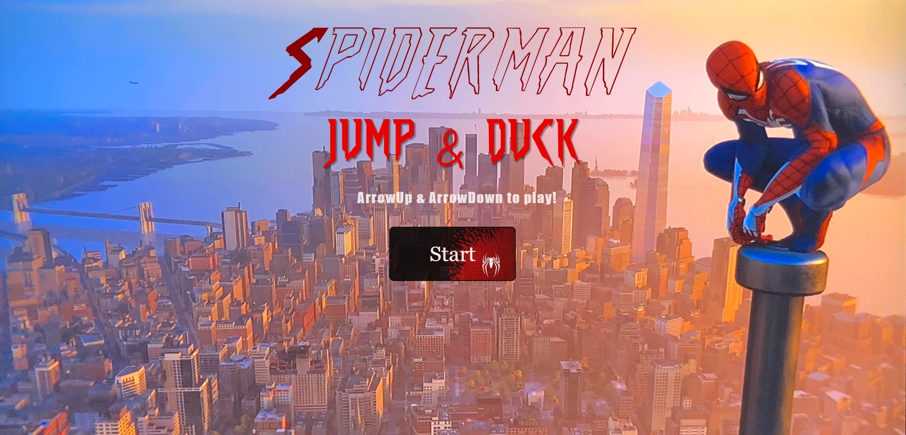

# Spiderman: Jump & Duck

[**CLICK HERE FOR DEPLOYED GAME**](https://hchughtai98.github.io/jump-n-duck/)

## Description

A jump & duck game made by Haris Chughtai that is heavily inspired by the minigame "Spooky Spikes" from Pummel Party.

## MVP

**Start Screen**:

- Landing page with a "Start" button.
- Clicking "Start" transitions to the game screen.

**Game Screen**:

- Display the player character and obstacles.
- Automatically scroll obstacles from right to left.
- Player can move the character up and down to avoid obstacles.
- Score counter to track the player's progress.

**Game Over Screen:**

- Displayed when the player collides with an obstacle.
- Show the final score.
- Option to restart the game.

**Game Loop**:

- Continuous gameplay until the player collides with an obstacle.
- Option to restart the game.

## Backlog

**Scoring System**:

- Incremental scoring as the player successfully avoids obstacles.
- Display the current score during gameplay.

**Background Music**:

- Background music starts when the game begins.
- Music volume can be adjusted.
- Music stops when the game ends or when the Easter Egg is activated.

**Easter Egg**:

- Hidden feature with specific trigger conditions.
- Unlocks a special screen or content.
- Option to return to the main screen from the Easter Egg screen.

## Data structure

**game.js**

    - this.landingPage
    - this.gameScreen
    - this.gameOverPage
    - this.easterEgg
    - this.scoreCounter
    - this.height
    - this.width
    - this.player
    - this.obstacles
    - this.score
    - this.animateId
    - this.gameIsOver
    - this.restartButton
    - this.obstaclePushFlag

**script.js**

    - game = new Game();
    - game.startGame();
    - game.gameLoop();

**player.js**

     this.gameScreen
    - this.x
    - this.y
    - this.height
    - this.width
    - this.directionX
    - this.directionY

**obstacle.js**

    - this.gameScreen
    - this.width
    - this.height
    - this.left
    - this.top
    - this.speed

## States y States Transitions

    - Start Screen
    - Game Screen
    - Game Over Screen
    - EasterEgg Screen

## Links

- [Trello Link](https://trello.com/b/t2QEB4cc/jump-duck-game)
- [Slides Link](https://docs.google.com/presentation/d/14SRa6fSTFbXDC2W8PUe93GtCLQ7XcX3FI5ZbZZjVCvQ/edit#slide=id.g2a3cffd579e_0_71)
- [Github repository Link](https://github.com/HChughtai98/jump-n-duck)
- [Deployment Link](https://hchughtai98.github.io/jump-n-duck/)
